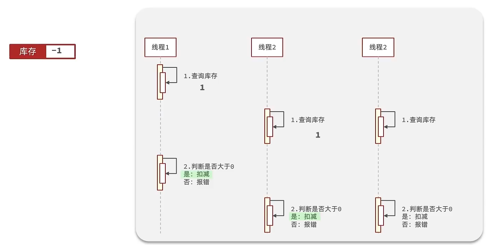

# Redis缓存实战

## 1. 缓存基础

### 1.1 添加缓存层


> 代码思路：如果缓存有，则直接返回，如果缓存不存在，则查询数据库，然后存入redis

```java
public Result queryById(Long id) {
        // 1.查询缓存
        String key = CACHE_SHOP_KEY + id;
        String shopJson = stringRedisTemplate.opsForValue().get(key);
        // 存在 -> 返回
        if (StrUtil.isNotBlank(shopJson)) {
            Shop shop = JSONUtil.toBean(shopJson, Shop.class);
            return Result.ok(shop);
        }
        // 2. 不存在 -> 查询数据库
        Shop shop = getById(id);
        // 不存在 -> 返回
        if (shop == null){
            return Result.fail("店铺不存在！");
        }
        // 存在写入redis
        stringRedisTemplate.opsForValue().set(key,JSONUtil.toJsonStr(shop));
        // 返回
        return Result.ok(shop);
    }
```

### 1.2 缓存不一致问题

由于我们的**缓存的数据源来自于数据库**,而数据库的**数据是会发生变化的**,因此,如果当数据库中**数据发生变化,而缓存却没有同步**,此时就会有**一致性问题存在**

#### 初步方案

> 1. 为缓存添加过期时间

```java
@Override
    public Result queryById(Long id) {
        // 1.查询缓存
        String key = CACHE_SHOP_KEY + id;
        String shopJson = stringRedisTemplate.opsForValue().get(key);
        // 存在 -> 返回
        if (StrUtil.isNotBlank(shopJson)) {
            Shop shop = JSONUtil.toBean(shopJson, Shop.class);
            return Result.ok(shop);
        }
        // 2. 不存在 -> 查询数据库
        Shop shop = getById(id);
        // 不存在 -> 返回
        if (shop == null) {
            return Result.fail("店铺不存在！");
        }
        // 存在写入redis 添加过期时间
        stringRedisTemplate.opsForValue().set(key, JSONUtil.toJsonStr(shop), CACHE_SHOP_TTL, TimeUnit.MINUTES);
        // 返回
        return Result.ok(shop);
    }

```

> 2. 先操作数据库再删除缓存

```java
/**
     * 更新店铺信息
     * @param shop
     * @return
     */
    @Override
    @Transactional
    public Result update(Shop shop) {
        Long id = shop.getId();
        if (id == null) {
            return Result.fail("店铺不存在");
        }
        // 更新数据库
        updateById(shop);
        // 删除缓存
        stringRedisTemplate.delete(CACHE_SHOP_KEY + id);
        return Result.ok();
    }
```

### 1.3  缓存穿透

缓存穿透 ：缓存穿透是指客户端请求的数据在缓存中和数据库中都不存在，这样缓存永远不会生效，这些请求都会打到数据库。

**解决方案：**

**缓存空对象思路分析：**当我们客户端访问不存在的数据时，先请求redis，但是此时redis中没有数据，此时会访问到数据库，但是数据库中也没有数据，这个数据穿透了缓存，直击数据库，我们都知道数据库能够承载的并发不如redis这么高，如果大量的请求同时过来访问这种不存在的数据，这些请求就都会访问到数据库，简单的解决方案就是哪怕这个数据在数据库中也不存在，我们也把这个数据存入到redis中去，这样，下次用户过来访问这个不存在的数据，那么在redis中也能找到这个数据就不会进入到缓存了


**布隆过滤：**布隆过滤器其实采用的是哈希思想来解决这个问题，通过一个庞大的二进制数组，走哈希思想去判断当前这个要查询的这个数据是否存在，如果布隆过滤器判断存在，则放行，这个请求会去访问redis，哪怕此时redis中的数据过期了，但是数据库中一定存在这个数据，在数据库中查询出来这个数据后，再将其放入到redis中，

假设布隆过滤器判断这个数据不存在，则直接返回

这种方式优点在于节约内存空间，存在误判，误判原因在于：布隆过滤器走的是哈希思想，只要哈希思想，就可能存在哈希冲突


> 缓存空对象
>
> - 查询数据库不存在时候写入空值
> - 命中空值后直接返回失败

```java
    /**
     * 按id查询
     * @param id id
     * @return
     */
    @Override
    public Result queryById(Long id) {
        // 1.查询缓存
        String key = CACHE_SHOP_KEY + id;
        String shopJson = stringRedisTemplate.opsForValue().get(key);
        // 存在 -> 返回
        if (StrUtil.isNotBlank(shopJson)) {
            Shop shop = JSONUtil.toBean(shopJson, Shop.class);
            return Result.ok(shop);
        }
        // 判断是否命中空值
        if (shopJson != null ){
            return Result.fail("店铺不存在!");
        }
        // 2. 不存在 -> 查询数据库
        Shop shop = getById(id);
        // 不存在 -> 返回
        if (shop == null) {
            // 缓存空对象
            stringRedisTemplate.opsForValue().set(key, "", CACHE_NULL_TTL, TimeUnit.MINUTES);
            return Result.fail("店铺不存在！");
        }
        // 存在写入redis 添加过期时间
        stringRedisTemplate.opsForValue().set(key, JSONUtil.toJsonStr(shop), CACHE_SHOP_TTL, TimeUnit.MINUTES);
        // 返回
        return Result.ok(shop);
    }
```

### 1.4 缓存雪崩

缓存雪崩是指在同一时段大量的缓存key同时失效或者Redis服务宕机，导致大量请求到达数据库，带来巨大压力。

解决方案：

* 给不同的Key的TTL添加随机值
* 利用Redis集群提高服务的可用性
* 给缓存业务添加降级限流策略
* 给业务添加多级缓存


### 1.5 缓存击穿

> tips：CAP定理，指的是在一个分布式系统中，一致性（Consistency）、可用性（Availability）、分区容错性（Partition tolerance）。CAP 原则指的是，这三个要素最多只能同时实现两点，不可能三者兼顾。

缓存击穿问题也叫热点Key问题，就是一个被高并发访问并且缓存重建业务较复杂的key突然失效了，无数的请求访问会在瞬间给数据库带来巨大的冲击。

常见的解决方案有两种：

* 互斥锁
* 逻辑过期

逻辑分析：假设线程1在查询缓存之后，本来应该去查询数据库，然后把这个数据重新加载到缓存的，此时只要线程1走完这个逻辑，其他线程就都能从缓存中加载这些数据了，但是假设在线程1没有走完的时候，后续的线程2，线程3，线程4同时过来访问当前这个方法， 那么这些线程都不能从缓存中查询到数据，那么他们就会同一时刻来访问查询缓存，都没查到，接着同一时间去访问数据库，同时的去执行数据库代码，对数据库访问压力过大


#### 互斥锁（高一致性方案）


> 互斥锁方案实现

```java
    /**
     * 查询店铺（互斥锁解决缓存击穿）
     *
     * @param id 店铺id
     * @return
     */
    private Shop queryWithMutex(Long id) {
        // 1.查询缓存
        String key = CACHE_SHOP_KEY + id;
        String shopJson = stringRedisTemplate.opsForValue().get(key);
        // 存在 -> 返回
        if (StrUtil.isNotBlank(shopJson)) {
            Shop shop = JSONUtil.toBean(shopJson, Shop.class);
            return shop;
        }
        // 判断是否命中空值
        if (shopJson != null) {
            return null;
        }
        Shop shop = null;
        try {
            // 执行缓存重建
            // 获取互斥锁
            boolean isLock = tryLock(LOCK_SHOP_KEY + id);
            if (!isLock) {
                Thread.sleep(50);
              	// double check 保证一致性
                shopJson = stringRedisTemplate.opsForValue().get(key);
                if (StrUtil.isNotBlank(shopJson)) {
                    shop = JSONUtil.toBean(shopJson, Shop.class);
                    return shop;
                }
                return queryWithMutex(id);
            }
            // 2. 不存在 -> 查询数据库
            shop = getById(id);
            // 不存在 -> 返回
            if (shop == null) {
                // 缓存空对象
                stringRedisTemplate.opsForValue().set(key, "", CACHE_NULL_TTL, TimeUnit.MINUTES);
                return null;
            }
            // 存在写入redis 添加过期时间
            stringRedisTemplate.opsForValue().set(key, JSONUtil.toJsonStr(shop), CACHE_SHOP_TTL, TimeUnit.MINUTES);
        } catch (InterruptedException e) {
            throw new RuntimeException(e);
        } finally {
            unlock(LOCK_SHOP_KEY + id);
        }

        // 返回
        return shop;
    }
```

#### 逻辑过期（低一致性方案）


> 逻辑过期方案实现

```java
/**
     * 查询店铺（逻辑过期解决缓存击穿）
     *
     * @param id 店铺id
     * @return
     */
    private Shop queryWithLogicalExpire(Long id) {
        // 查询缓存
        String key = CACHE_SHOP_KEY + id;
        String shopJson = stringRedisTemplate.opsForValue().get(key);
        // 不存在 -> 返回 null
        if (StrUtil.isBlank(shopJson)) {
            return null;
        }
        // 存在
        RedisData redisData = JSONUtil.toBean(shopJson, RedisData.class);
        JSONObject data = (JSONObject) redisData.getData();
        Shop shop = JSONUtil.toBean(data, Shop.class);
        LocalDateTime expireTime = redisData.getExpireTime();
        // 判断是否过期
        if (expireTime.isAfter(LocalDateTime.now())) {
            // 未过期 -> 返回
            return shop;
        }
        // 过期 -> 缓存重建
        // 缓存重建
        // 获取锁 成功 -> 开启线程执行缓存重建
        boolean isLock = tryLock(LOCK_SHOP_KEY + id);
        if (isLock) {
            // double check 查询过期时间
            shopJson = stringRedisTemplate.opsForValue().get(key);
            // 不存在 -> 返回 null
            if (StrUtil.isBlank(shopJson)) {
                return null;
            }
            // 存在
            redisData = JSONUtil.toBean(shopJson, RedisData.class);
            data = (JSONObject) redisData.getData();
            shop = JSONUtil.toBean(data, Shop.class);
            expireTime = redisData.getExpireTime();
            // 判断是否过期
            if (expireTime.isAfter(LocalDateTime.now())) {
                // 未过期 -> 返回
                return shop;
            }
            // 过期
            CACHE_REBUILD_EXECUTOR.submit(() -> {
                try {
                    this.saveShop2Redis(id, 20L);
                } catch (Exception e) {
                    throw new RuntimeException(e);
                } finally {
                    unlock(LOCK_SHOP_KEY + id);
                }
            });
        }
        // 获取锁 失败 -> 返回老数据（过期的）
        return shop;
    }
```

## 2. 基于Redis的分布式唯一ID生成器

随着业务规模越来越大，mysql的单表的容量不宜超过500W，数据量过大之后，我们要进行拆库拆表，但拆分表了之后，他们从逻辑上讲他们是同一张表，所以他们的id是不能一样的，于是需要保证id的唯一性。

> Redis自增可以解决这一问题。Redis使用唯一的key可以实现value的自增，且不会重复。
>
> 为了加强id的复杂度可以使用时间戳拼接自增值实现id生成。
>
> 拼接时，将时间戳的值**左移32位**再与自增数值进行**或**运算实现。

```java
@Component
public class RedisIdWorker {
    /**
     * 开始时间戳
     */
    private static final long BEGIN_TIMESTAMP = 1640995200L;
    /**
     * 序列号的位数
     */
    private static final int COUNT_BITS = 32;

    private StringRedisTemplate stringRedisTemplate;

    public RedisIdWorker(StringRedisTemplate stringRedisTemplate) {
        this.stringRedisTemplate = stringRedisTemplate;
    }

    public long nextId(String keyPrefix) {
        // 1.生成时间戳
        LocalDateTime now = LocalDateTime.now();
        long nowSecond = now.toEpochSecond(ZoneOffset.UTC);
        long timestamp = nowSecond - BEGIN_TIMESTAMP;

        // 2.生成序列号
        // 2.1.获取当前日期，精确到天
        String date = now.format(DateTimeFormatter.ofPattern("yyyy:MM:dd"));
        // 2.2.自增长
        long count = stringRedisTemplate.opsForValue().increment("icr:" + keyPrefix + ":" + date);

        // 3.拼接并返回
        return timestamp << COUNT_BITS | count;
    }
}
```

## 3. 秒杀下单

### 超卖问题

假设线程1过来查询库存，判断出来库存大于1，正准备去扣减库存，但是还没有来得及去扣减，此时线程2过来，线程2也去查询库存，发现这个数量一定也大于1，那么这两个线程都会去扣减库存，最终多个线程相当于一起去扣减库存，此时就会出现库存的超卖问题。



#### 解决方案1-乐观锁

  乐观锁：会有一个版本号，每次操作数据会对版本号+1，再提交回数据时，会去校验是否比之前的版本大1 ，如果大1 ，则进行操作成功，这套机制的核心逻辑在于，如果在操作过程中，版本号只比原来大1 ，那么就意味着操作过程中没有人对他进行过修改，他的操作就是安全的，如果不大1，则数据被修改过，当然乐观锁还有一些变种的处理方式比如cas

  乐观锁的典型代表：就是cas，利用cas进行无锁化机制加锁，var5 是操作前读取的内存值，while中的var1+var2 是预估值，如果预估值 == 内存值，则代表中间没有被人修改过，此时就将新值去替换 内存值

> 注意：这里的库存扣减操作在 SQL 语句中实现的，所以不存在多线程情况下重复设置库存值的情况。

```java
        // 查询库存是否充足
        if (seckillVoucher.getStock() < 1) {
            return Result.fail("库存不足");
        }
        // 扣减库存
        boolean success = iSeckillVoucherService.update()
                .setSql("stock = stock - 1")
                .eq("voucher_id",voucherId)
          			// 当每次更新库存时候都比对是否与上次查询数据一致
                .eq("stock",seckillVoucher.getStock())   
                .update();
        if (!success) {
            return Result.fail("库存不足");
        }
```

**但是这种方法会导致请求失败率大大增加！**

改进方案：不要求库存值一定要等于上次库存值，只要**库存量 > 0** 就可以更新。

```java
 boolean success = iSeckillVoucherService.update()
                .setSql("stock = stock - 1")
                .eq("voucher_id",voucherId)
   							// 当 库存>0 就执行更新
                .gt("stock",0)
                .update();
```


### 一人一单问题

#### 基本实现

```java

@Override
public Result seckillVoucher(Long voucherId) {
    // 1.查询优惠券
    SeckillVoucher voucher = seckillVoucherService.getById(voucherId);
    // 2.判断秒杀是否开始
    if (voucher.getBeginTime().isAfter(LocalDateTime.now())) {
        // 尚未开始
        return Result.fail("秒杀尚未开始！");
    }
    // 3.判断秒杀是否已经结束
    if (voucher.getEndTime().isBefore(LocalDateTime.now())) {
        // 尚未开始
        return Result.fail("秒杀已经结束！");
    }
    // 4.判断库存是否充足
    if (voucher.getStock() < 1) {
        // 库存不足
        return Result.fail("库存不足！");
    }
    // 5.一人一单逻辑
    // 5.1.用户id
    Long userId = UserHolder.getUser().getId();
    int count = query().eq("user_id", userId).eq("voucher_id", voucherId).count();
    // 5.2.判断是否存在
    if (count > 0) {
        // 用户已经购买过了
        return Result.fail("用户已经购买过一次！");
    }

    //6，扣减库存
    boolean success = seckillVoucherService.update()
            .setSql("stock= stock -1")
            .eq("voucher_id", voucherId).update();
    if (!success) {
        //扣减库存
        return Result.fail("库存不足！");
    }
    //7.创建订单
    VoucherOrder voucherOrder = new VoucherOrder();
    // 7.1.订单id
    long orderId = redisIdWorker.nextId("order");
    voucherOrder.setId(orderId);

    voucherOrder.setUserId(userId);
    // 7.3.代金券id
    voucherOrder.setVoucherId(voucherId);
    save(voucherOrder);

    return Result.ok(orderId);

}
```

**存在问题：**现在的问题还是和之前一样，并发过来，查询数据库，都不存在订单，所以我们还是需要加锁，但是乐观锁比较适合更新数据，而现在是插入数据，所以我们需要使用悲观锁操作

#### 单节点下解决方案

> `事务失效处理`
>
> 此处因为抽取了createVoucherOrder的逻辑做了封装，在createVoucherOrder加上事务注解，并处理了这种情况下发生的事务失效问题。
>
> 处理事务失效：这里的方法上使用AopContent获取当前对象的代理，通过代理对象调用事务方法。
>
> - 加依赖
>
>   ```xml
>   <dependency>
>      <groupId>org.aspectj</groupId>
>      <artifactId>aspectjweaver</artifactId>
>   </dependency>
>   ```
>
> - 启动类加注解暴露代理对象`@EnableAspectJAutoProxy(exposeProxy = true)`
>
> - 获取代理对象
>
>   ```java
>    IVoucherOrderService proxy = (IVoucherOrderService) AopContext.currentProxy();
>   ```
>
> 方式二：
>
> 注入自身：
>
> ```java
> @Resource
> private IVoucherOrderService iVoucherOrderService;
> ....
> ....
> iVoucherOrderService.createVoucherOrder(voucherId);
> ```
>
> 

```java
    @Override
    public Result seckillVoucher(Long voucherId) {
        // 查询秒杀券信息
        SeckillVoucher seckillVoucher = iSeckillVoucherService.getById(voucherId);
        // 判断秒杀是否开始或结束
        if (seckillVoucher.getBeginTime().isAfter(LocalDateTime.now())) {
            return Result.fail("尚未开始");
        }
        if (seckillVoucher.getEndTime().isBefore(LocalDateTime.now())) {
            return Result.fail("已经结束");
        }
        // 查询库存是否充足
        if (seckillVoucher.getStock() < 1) {
            return Result.fail("库存不足");
        }
        // 获取用户id
        Long userId = UserHolder.getUser().getId();
        // 上锁解决并发问题 控制事务提交
        synchronized (userId.toString().intern()) {
            // 获取代理对象解决事务失效问题
            IVoucherOrderService proxy = (IVoucherOrderService) AopContext.currentProxy();
            return proxy.createVoucherOrder(voucherId);
        }
    }

    @Transactional
    public Result createVoucherOrder(Long voucherId) {
        // 一人一单的问题
        // 查询用户订单
        Long userId = UserHolder.getUser().getId();
        int count = query().eq("user_id", userId).eq("voucher_id", voucherId).count();
        // 判断是否下过单
        if (count > 0) {
            return Result.fail("用户已经购买过该优惠券了！");
        }

        // 扣减库存
        boolean success = iSeckillVoucherService.update()
                .setSql("stock = stock - 1")
                .eq("voucher_id", voucherId)
                .gt("stock", 0)
                .update();
        if (!success) {
            return Result.fail("库存不足");
        }
        // 创建订单
        VoucherOrder voucherOrder = new VoucherOrder();
        // 生成全局唯一订单id
        voucherOrder.setId(redisIdWorker.nextId("order"));
        voucherOrder.setUserId(UserHolder.getUser().getId());
        voucherOrder.setVoucherId(voucherId);
        // 订单存储入库
        save(voucherOrder);
        // 返回订单id
        return Result.ok(voucherOrder.getId());
    }
```

**存在问题：**多节点部署下，JVM不同，synchronized失效！！

### **分布式锁：**


Redis：redis作为分布式锁是非常常见的一种使用方式，现在企业级开发中基本都使用redis或者zookeeper作为分布式锁，利用setnx这个方法，如果插入key成功，则表示获得到了锁，如果有人插入成功，其他人插入失败则表示无法获得到锁，利用这套逻辑来实现分布式锁

#### 实现分布式锁版本一

* 加锁逻辑

**锁的基本接口**

```Java
public interface ILock {
    /**
     * 获取锁
     * @param timeout 超时时间
     * @return boolean
     */
    boolean tryLock(Long timeout);
    /**
     * 释放锁
     */
    void unLock();
}

```

**加锁逻辑**

```java
private static final String KEY_PREFIX="lock:"
@Override
public boolean tryLock(long timeoutSec) {
    // 获取线程标示
    String threadId = Thread.currentThread().getId()
    // 获取锁
    Boolean success = stringRedisTemplate.opsForValue()
            .setIfAbsent(KEY_PREFIX + name, threadId + "", timeoutSec, TimeUnit.SECONDS);
    return Boolean.TRUE.equals(success);
}
```

**释放锁逻辑**

```java
public void unlock() {
    //通过del删除锁
    stringRedisTemplate.delete(KEY_PREFIX + name);
}
```

> 修改业务代码

```java
.....
//获取锁对象
boolean isLock = lock.tryLock(1200);
//加锁失败
if (!isLock) {
   return Result.fail("不允许重复下单");
}
try {
   //获取代理对象(事务)
   IVoucherOrderService proxy = (IVoucherOrderService) AopContext.currentProxy();
   return proxy.createVoucherOrder(voucherId);
} finally {
   //释放锁
   lock.unlock();
}
```

#### 分布式锁误删情况

持有锁的线程在锁的内部出现了阻塞，导致他的锁自动释放，这时其他线程，线程2来尝试获得锁，就拿到了这把锁，然后线程2在持有锁执行过程中，线程1反应过来，继续执行，而线程1执行过程中，走到了删除锁逻辑，此时就会把本应该属于线程2的锁进行删除，这就是误删别人锁的情况说明

解决方案：解决方案就是在每个线程释放锁的时候，去判断一下当前这把锁是否属于自己，如果属于自己，则不进行锁的删除，假设还是上边的情况，线程1卡顿，锁自动释放，线程2进入到锁的内部执行逻辑，此时线程1反应过来，然后删除锁，但是线程1，一看当前这把锁不是属于自己，于是不进行删除锁逻辑，当线程2走到删除锁逻辑时，如果没有卡过自动释放锁的时间点，则判断当前这把锁是属于自己的，于是删除这把锁。


#### 解决锁误删情况

> 方案：将`线程标识`(如：UUID + 线程ID) 作为value存储入对应的key中，每次释放锁删除锁标识的时候判断当前线程的UUID + 线程ID是否相等，相等则删除锁标志，否则不做操作。

具体实现：

**上锁**

```java
    @Override
    public boolean tryLock(Long timeout) {
        String threadId = ID_PREFIX + Thread.currentThread().getId();
        // 获取锁
        Boolean success = stringRedisTemplate.opsForValue().setIfAbsent(KEY_PREFIX + name, threadId , timeout, TimeUnit.SECONDS);
        // 预防拆箱空指针
        return Boolean.TRUE.equals(success);
    }
```

**释放锁**

```java
    @Override
    public void unLock() {
        // 获取线程标识
        String threadId = ID_PREFIX + Thread.currentThread().getId();
        // 获取锁中的线程标识
        String id = stringRedisTemplate.opsForValue().get(KEY_PREFIX + name);
        // 判断一致
        if (id.equals(threadId)) {
            // 释放锁
            stringRedisTemplate.delete(KEY_PREFIX + name);
        }
    }
```

#### 分布式锁的原子性问题

线程1现在持有锁之后，在执行业务逻辑过程中，他正准备删除锁，而且已经走到了条件判断的过程中，比如他已经拿到了当前这把锁确实是属于他自己的，正准备删除锁，但是此时他的锁到期了，那么此时线程2进来，但是线程1他会接着往后执行，当他卡顿结束后，他直接就会执行删除锁那行代码，相当于条件判断并没有起到作用，这就是删锁时的原子性问题，之所以有这个问题，是因为线程1的拿锁，比锁，删锁，实际上并不是原子性的，我们要防止刚才的情况发生。


#### Lua脚本方式解决原子性问题

由于判断是否为当前线程创建的锁和删除锁的操作是在Lua中实现的，所以在Java中解决了原子性问题。

> Lua脚本
>
> ```lua
> -- 这里的 KEYS[1] 就是锁的key，这里的ARGV[1] 就是当前线程标示
> -- 获取锁中的标示，判断是否与当前线程标示一致
> if (redis.call('GET', KEYS[1]) == ARGV[1]) then
>   -- 一致，则删除锁
>   return redis.call('DEL', KEYS[1])
> end
> -- 不一致，则直接返回
> return 0
> ```

**使用Java代码调用Lua脚本**

我们的RedisTemplate中，可以利用execute方法去执行lua脚本，参数对应关系就如下图


**释放锁逻辑修改**

```java
private static final DefaultRedisScript<Long> UNLOCK_SCRIPT;
    static {
        UNLOCK_SCRIPT = new DefaultRedisScript<>();
        UNLOCK_SCRIPT.setLocation(new ClassPathResource("unlock.lua"));
        UNLOCK_SCRIPT.setResultType(Long.class);
    }

public void unlock() {
    // 调用lua脚本
    stringRedisTemplate.execute(
            UNLOCK_SCRIPT,
            Collections.singletonList(KEY_PREFIX + name),
            ID_PREFIX + Thread.currentThread().getId());
}
```

### 初步优化秒杀接口

```bash
原步骤：

1、查询优惠卷

2、判断秒杀库存是否足够

3、查询订单

4、校验是否是一人一单

5、扣减库存

6、创建订单
```

> `优化方案：`
>
> 将耗时比较短的逻辑判断放入到redis中，比如是否库存足够，比如是否一人一单，这样的操作，只要这种逻辑可以完成，就意味着我们是一定可以下单完成的，我们只需要进行快速的逻辑判断，根本就不用等下单逻辑走完，我们直接给用户返回成功， 再在后台开一个线程，后台线程慢慢的去执行queue里边的消息。


#### 1. lua脚本判断用户下单资格

```lua
---
--- Generated by EmmyLua(https://github.com/EmmyLua)
--- Created by qianzhikang.
--- DateTime: 2023/4/27 15:50
--- 判断用户是否具有秒杀资格
--- 参数：优惠券id
local voucherId = ARGV[1]
--- 参数：用户id参数
local userId = ARGV[2]
--- 订单id
local orderId = ARGV[3]

--- key： 库存key
local stockKey = 'seckill:stock:' .. voucherId
--- key: 订单key
local orderKey = 'seckill:order:' .. voucherId

--- 脚本业务
if (tonumber(redis.call('get', stockKey)) <= 0) then
    return 1
end
--- 判断当前用户是否存在在set集合中
if (redis.call('sismember', orderKey, userId) == 1) then
    return 2
end
--- 扣减库存
redis.call('incrby', stockKey, -1)
--- 下单保存id
redis.call('sadd', orderKey, userId)
return 0
```

#### 2.  添加优惠的同时将优惠券信息同步到redis

```java
@Override
@Transactional
public void addSeckillVoucher(Voucher voucher) {
    // 保存优惠券
    save(voucher);
    // 保存秒杀信息
    SeckillVoucher seckillVoucher = new SeckillVoucher();
    seckillVoucher.setVoucherId(voucher.getId());
    seckillVoucher.setStock(voucher.getStock());
    seckillVoucher.setBeginTime(voucher.getBeginTime());
    seckillVoucher.setEndTime(voucher.getEndTime());
    seckillVoucherService.save(seckillVoucher);
    // 保存秒杀库存到Redis中
    //private static final String SECKILL_STOCK_KEY ="seckill:stock:"
    stringRedisTemplate.opsForValue().set(SECKILL_STOCK_KEY + voucher.getId(), voucher.getStock().toString());
}
```

#### 3. 下单接口实现修改

> 1. 在lua脚本通过后，将订单信息加入到阻塞队列
> 2. 直接返回成功
> 3. 添加类初始化后自动调用线程池提交任务：任务内容为从阻塞队列获取订单信息入库

```java
//异步处理线程池
private static final ExecutorService SECKILL_ORDER_EXECUTOR = Executors.newSingleThreadExecutor();

//在类初始化之后执行，因为当这个类初始化好了之后，随时都是有可能要执行的
@PostConstruct
private void init() {
   SECKILL_ORDER_EXECUTOR.submit(new VoucherOrderHandler());
}
// 用于线程池处理的任务
// 当初始化完毕后，就会去从对列中去拿信息
 private class VoucherOrderHandler implements Runnable{

        @Override
        public void run() {
            while (true){
                try {
                    // 1.获取队列中的订单信息
                    VoucherOrder voucherOrder = orderTasks.take();
                    // 2.创建订单
                    handleVoucherOrder(voucherOrder);
                } catch (Exception e) {
                    log.error("处理订单异常", e);
                }
          	 }
        }
     
       private void handleVoucherOrder(VoucherOrder voucherOrder) {
            //1.获取用户
            Long userId = voucherOrder.getUserId();
            // 2.创建锁对象
            RLock redisLock = redissonClient.getLock("lock:order:" + userId);
            // 3.尝试获取锁
            boolean isLock = redisLock.lock();
            // 4.判断是否获得锁成功
            if (!isLock) {
                // 获取锁失败，直接返回失败或者重试
                log.error("不允许重复下单！");
                return;
            }
            try {
				//注意：由于是spring的事务是放在threadLocal中，此时的是多线程，事务会失效
                proxy.createVoucherOrder(voucherOrder);
            } finally {
                // 释放锁
                redisLock.unlock();
            }
    }
     //a
	private BlockingQueue<VoucherOrder> orderTasks =new  ArrayBlockingQueue<>(1024 * 1024);

    @Override
    public Result seckillVoucher(Long voucherId) {
        Long userId = UserHolder.getUser().getId();
        long orderId = redisIdWorker.nextId("order");
        // 1.执行lua脚本
        Long result = stringRedisTemplate.execute(
                SECKILL_SCRIPT,
                Collections.emptyList(),
                voucherId.toString(), userId.toString(), String.valueOf(orderId)
        );
        int r = result.intValue();
        // 2.判断结果是否为0
        if (r != 0) {
            // 2.1.不为0 ，代表没有购买资格
            return Result.fail(r == 1 ? "库存不足" : "不能重复下单");
        }
        VoucherOrder voucherOrder = new VoucherOrder();
        // 2.3.订单id
        long orderId = redisIdWorker.nextId("order");
        voucherOrder.setId(orderId);
        // 2.4.用户id
        voucherOrder.setUserId(userId);
        // 2.5.代金券id
        voucherOrder.setVoucherId(voucherId);
        // 2.6.放入阻塞队列
        orderTasks.add(voucherOrder);
        //3.获取代理对象
         proxy = (IVoucherOrderService)AopContext.currentProxy();
        //4.返回订单id
        return Result.ok(orderId);
    }
     
      @Transactional
    public  void createVoucherOrder(VoucherOrder voucherOrder) {
        Long userId = voucherOrder.getUserId();
        // 5.1.查询订单
        int count = query().eq("user_id", userId).eq("voucher_id", voucherOrder.getVoucherId()).count();
        // 5.2.判断是否存在
        if (count > 0) {
            // 用户已经购买过了
           log.error("用户已经购买过了");
           return ;
        }

        // 6.扣减库存
        boolean success = seckillVoucherService.update()
                .setSql("stock = stock - 1") // set stock = stock - 1
                .eq("voucher_id", voucherOrder.getVoucherId()).gt("stock", 0) // where id = ? and stock > 0
                .update();
        if (!success) {
            // 扣减失败
            log.error("库存不足");
            return ;
        }
        save(voucherOrder);
 
    }
```

#### 方案漏洞

当系统宕机重启后，阻塞队列中的订单创建任务将全部丢失，不可恢复！建议使用消息队列代替阻塞队列。


